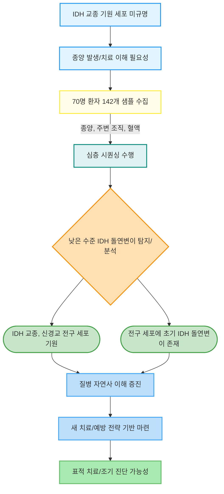

# IDH-mutant gliomas arise from glial progenitor cells harboring the initial driver mutation.

## 메타데이터
- **저널**: Science (New York, N.Y.)
- **출판일**: 2026-01-08
- **저자**: Jung Won Park, Jiehoon Kwak, Keon-Woo Kim, Saehoon Jung, Chang Hyun Nam...
- **DOI**: [10.1126/science.adt0559](https://doi.org/10.1126/science.adt0559)
- **링크**: [논문 보기](https://pubmed.ncbi.nlm.nih.gov/41505555/)

## 한 줄 요약
주어진 초록의 내용이 중간에 끊겨 있어, 전체 논문의 상세한 내용을 파악하는 데 한계가 있습니다.

---

## 📝 요약 (Summary)

주어진 초록의 내용이 중간에 끊겨 있어, 전체 논문의 상세한 내용을 파악하는 데 한계가 있습니다. 특히 정량적 결과나 심층적인 방법론, 논의 부분은 포함되어 있지 않습니다. 하지만 제공된 제목과 초록의 앞부분을 바탕으로 최대한 상세하게 요약해 드리겠습니다.

---

### 핵심 발견 (Key Findings)

이 연구의 가장 중요한 핵심 발견은 제목에서 명확하게 제시됩니다: **IDH-돌연변이 교종(IDH-mutant gliomas)이 초기 운전자 돌연변이(initial driver mutation)를 지닌 신경교 전구 세포(glial progenitor cells)에서 기원한다**는 것입니다. 이는 기존에 불분명했던 IDH-돌연변이 교종의 발생 세포(cell of origin)에 대한 명확한 해답을 제시합니다.

1.  **IDH-돌연변이 교종의 발생 세포 규명:**
    *   **발견:** 연구는 IDH-돌연변이 교종이 특정 유형의 뇌 세포인 신경교 전구 세포(glial progenitor cells)에서 시작된다는 것을 밝혀냈습니다. 이는 종양 발생의 초기 단계에서 이미 IDH 돌연변이를 포함하고 있는 전구 세포가 존재하며, 이들이 궁극적으로 교종으로 발전한다는 것을 의미합니다.
    *   **중요성:** IDH-돌연변이 교종은 젊은 성인에게서 가장 흔하게 발생하는 악성 원발성 뇌종양(malignant primary brain tumor)임에도 불구하고, 그 기원 세포에 대한 이해가 매우 부족했습니다. 이 발견은 종양 발생의 근원을 정확히 짚어내어, 질병의 자연사(natural history)와 진행 과정을 이해하는 데 결정적인 통찰을 제공합니다. 이는 기존에 추정만 하던 발생 모델을 구체적인 세포 유형으로 특정하여 과학적 기반을 강화합니다.

2.  **초기 운전자 돌연변이의 존재 위치 및 시기:**
    *   **발견:** IDH 돌연변이가 이미 종양으로 발전하기 전, 즉 "초기 운전자 돌연변이(initial driver mutation)"로서 신경교 전구 세포에 존재함을 시사합니다. 이는 돌연변이가 종양의 형성 과정에서 나중에 획득되는 것이 아니라, 질병의 가장 초기 단계부터 발생 세포 내에 내재되어 있다는 것을 의미합니다.
    *   **중요성:** 이 발견은 암 예방 및 조기 진단 전략 개발에 중요한 단서를 제공합니다. 만약 초기 돌연변이를 가진 전구 세포를 식별하거나 특정할 수 있다면, 종양 형성 전에 개입하여 질병의 발병을 막거나 진행을 늦출 수 있는 새로운 치료 표적(therapeutic target)을 발굴할 수 있습니다. 또한, 종양의 클론 진화(clonal evolution) 과정을 이해하는 데 있어 첫 단추가 어디서 시작되는지를 명확히 합니다.

3.  **종양 진화 이해 및 새로운 치료 전략 개발의 토대 마련:**
    *   **발견:** 이 연구는 IDH-돌연변이 교종의 발생 세포와 초기 돌연변이의 존재를 명확히 함으로써, 종양이 어떻게 시작되고 발전하는지에 대한 근본적인 이해를 제공합니다.
    *   **중요성:** 이러한 기초 지식은 단순히 학문적 호기심을 넘어, 실제 환자 치료에 직접적인 영향을 미 미칩니다. 종양의 기원 세포를 알면, 해당 세포 특이적인 표적 치료제(cell-specific targeted therapy)를 개발하거나, 초기 돌연변이를 가진 세포를 제거하는 예방적 전략을 고안할 수 있습니다. 예를 들어, 신경교 전구 세포의 특정 신호 전달 경로(signaling pathway)를 차단하는 약물을 개발하는 방향을 모색할 수 있습니다.

*참고: 주어진 초록이 "Low-level"에서 끊겼기 때문에, 돌연변이의 낮은 수준(low-level)을 어떻게 탐지하고 해석했는지에 대한 구체적인 정량적 결과나 후속 발견에 대해서는 언급할 수 없습니다.*

### 연구 방법 (Methods)

제공된 초록의 내용만으로는 상세한 연구 방법을 모두 파악하기는 어렵지만, 명시된 부분은 다음과 같습니다.

1.  **주요 기술/방법론:**
    *   **심층 시퀀싱 (Deep Sequencing):** 연구의 핵심 기술로 사용되었습니다. 심층 시퀀싱은 특정 유전자 영역이나 전체 게놈(genome)을 매우 높은 커버리지(coverage)로 여러 번 반복하여 시퀀싱하는 방법으로, 매우 낮은 수준(low-level)으로 존재하는 돌연변이 클론(mutant clone)이나 희귀 변이(rare variant)를 정확하게 탐지하는 데 필수적입니다. 이 기술을 통해 IDH 돌연변이의 존재 여부와 그 빈도(allele frequency)를 정밀하게 측정했을 것으로 추정됩니다.

2.  **데이터셋 정보:**
    *   **샘플 수:** 총 70명의 개인으로부터 142개의 조직 샘플을 분석했습니다.
    *   **샘플 종류:**
        *   **종양 (Tumors):** 실제 IDH-돌연변이 교종 조직 샘플.
        *   **종양 주변 피질 또는 뇌실하 영역 (Peritumoral cortex or subventricular zones):** 종양 주변의 정상 또는 비정상 조직으로, 종양 발생의 초기 단계 또는 잠재적 기원 부위를 탐색하는 데 중요합니다. 특히 뇌실하 영역(subventricular zone, SVZ)은 성체 신경줄기세포(adult neural stem cells)가 존재하는 부위로, 뇌종양의 기원 세포 연구에서 중요한 후보지로 간주됩니다.
        *   **혈액 (Blood):** 환자의 유전적 배경(germline genetic background)을 확인하고, 체세포 돌연변이(somatic mutation)와 생식세포 돌연변이(germline mutation)를 구별하는 데 사용되었을 것입니다.

3.  **분석 파이프라인/실험 설계 (추정):**
    *   연구는 다양한 조직 샘플에서 심층 시퀀싱을 수행하여 IDH 돌연변이의 존재 여부와 그 발현 수준을 탐지하는 데 중점을 두었을 것입니다.
    *   특히, 종양 주변 조직(peritumoral tissue)과 뇌실하 영역에서 '낮은 수준(low-level)'의 IDH 돌연변이를 탐지하는 것이 중요했을 것으로 보입니다. 이는 종양 형성 이전에 이미 전구 세포에 돌연변이가 존재한다는 가설을 검증하는 데 핵심적인 단계입니다.
    *   각 샘플에서 발견된 IDH 돌연변이의 클론성(clonality)과 공간적 분포(spatial distribution)를 분석하여, 어느 세포에서 돌연변이가 먼저 발생했는지, 그리고 이 돌연변이를 가진 세포가 어떻게 증식하여 종양을 형성했는지를 추론했을 것입니다.

*참고: 초록이 "Low-level"에서 끊겼기 때문에, 이 "낮은 수준"의 돌연변이가 구체적으로 어떤 통계적, 생물정보학적 분석을 통해 확인되었는지, 예를 들어 변이 호출(variant calling), 클론성 분석(clonal analysis), 계통 발생 분석(phylogenetic analysis) 등의 상세한 파이프라인은 알 수 없습니다.*

### 연구 배경 및 동기 (Background)

이 연구는 암 연구의 근본적인 질문 중 하나인 "종양의 기원 세포(cell of origin)는 무엇인가?"에 대한 해답을 찾고자 하는 동기에서 출발했습니다.

1.  **해결하고자 하는 문제:**
    *   **종양 기원 세포의 중요성:** 초기 운전자 돌연변이(initial driver mutation)를 지닌 세포를 식별하는 것은 종양의 진화(tumor evolution) 과정을 이해하고, 새로운 치료법을 개발하는 데 매우 중요합니다. 암은 단일 세포에서 시작되어 비정상적으로 증식하는 질병이므로, 이 시작점이 되는 세포를 아는 것은 질병의 본질을 파악하는 데 필수적입니다.
    *   **IDH-돌연변이 교종의 미해결 문제:** 이소시트레이트 탈수소효소(Isocitrate Dehydrogenase, IDH) 돌연변이를 가진 교종(IDH-mutant gliomas)은 젊은 성인에게서 발생하는 가장 흔한 악성 원발성 뇌종양입니다. 그럼에도 불구하고, 이 종양이 어떤 세포에서 기원하는지에 대한 이해가 "현재까지 미흡(currently poorly understood)"한 상태였습니다. 이 불확실성은 진단, 예후 예측, 그리고 무엇보다 효과적인 치료 전략 개발에 큰 걸림돌이 되어왔습니다.

2.  **기존 연구의 한계점 (추정):**
    *   기존 연구들은 IDH-돌연변이 교종의 분자적 특성(molecular characteristics)이나 임상적 진행(clinical progression)에 대해서는 많은 정보를 제공했지만, 종양 발생의 가장 초기 단계인 "기원 세포" 자체를 명확히 식별하는 데는 한계가 있었을 것입니다.
    *   이는 아마도 초기 돌연변이를 가진 세포가 매우 드물게 존재하거나, 일반적인 조직 샘플링 및 시퀀싱 방법으로는 낮은 수준의 돌연변이를 정확하게 탐지하기 어려웠기 때문일 수 있습니다. 또한, 종양 주변의 미세 환경(microenvironment)이나 잠재적 기원 부위(예: 뇌실하 영역)에 대한 심층적인 분석이 부족했을 가능성도 있습니다.
    *   따라서 이 연구는 "심층 시퀀싱(deep sequencing)"과 다양한 종류의 조직 샘플(종양, 종양 주변 조직, 혈액)을 통합적으로 분석함으로써, 기존 방법론으로는 해결하기 어려웠던 기원 세포 문제를 해결하고자 했습니다.

### 의의 및 한계 (Significance & Limitations)

**의의 (Significance):**

1.  **생물학적 통찰력 증진:** 이 연구는 IDH-돌연변이 교종의 발생 세포를 신경교 전구 세포로 명확히 규명함으로써, 이 치명적인 뇌종양의 생물학적 기원에 대한 근본적인 이해를 크게 진전시켰습니다. 이는 질병의 병인(pathogenesis)과 초기 진화 경로를 이해하는 데 중요한 이정표가 됩니다.
2.  **새로운 치료 및 예방 전략 개발의 기반 마련:** 종양의 시작점과 초기 운전자 돌연변이를 아는 것은 향후 치료법 개발에 결정적인 영향을 미칩니다.
    *   **표적 치료:** 신경교 전구 세포 특이적인 표적(specific targets)을 발굴하거나, 초기 IDH 돌연변이의 기능을 억제하는 약물을 개발할 수 있습니다.
    *   **조기 진단 및 예방:** 초기 돌연변이를 가진 전구 세포를 식별하는 바이오마커(biomarker)를 개발하여, 종양 형성 전에 고위험군을 선별하고 예방적 개입을 시도할 수 있는 가능성을 열어줍니다.
    *   **재발 방지:** 종양의 기원 세포를 이해하면, 재발하는 종양이 어디서부터 다시 시작되는지 예측하고, 잔존하는 초기 돌연변이 세포를 제거하는 전략을 세울 수 있습니다.
3.  **암 연구 방법론적 기여:** 심층 시퀀싱을 통해 낮은 수준의 돌연변이를 정밀하게 탐지하고, 다양한 조직 샘플을 통합적으로 분석하는 접근 방식은 다른 유형의 암종에서도 기원 세포를 규명하는 데 적용될 수 있는 모델을 제시합니다.

**한계 (Limitations):**

1.  **초록의 정보 부족:** 가장 큰 한계는 제공된 초록이 "Low-level"에서 끊겨 있어, 연구의 구체적인 결과, 방법론의 세부 사항, 통계적 유의성, 그리고 연구자들이 스스로 언급한 한계점을 파악할 수 없다는 점입니다. 예를 들어, '낮은 수준'의 돌연변이가 어떤 임상적 의미를 가지는지, 이 돌연변이가 모든 신경교 전구 세포에 나타나는지, 아니면 특정 아형(subtype)에만 나타나는지 등의 정보가 없습니다.
2.  **인과 관계의 복잡성:** 비록 신경교 전구 세포가 IDH 돌연변이를 지니고 종양의 기원이 된다고 밝혀졌지만, 이 돌연변이가 *어떻게* 해당 전구 세포를 악성으로 전환시키는지에 대한 구체적인 분자 메커니즘(molecular mechanism)은 이 초록만으로는 설명되지 않습니다. IDH 돌연변이 외에 다른 유전적/후성유전적 변화(epigenetic changes)나 미세 환경적 요인(microenvironmental factors)이 종양 발생에 어떻게 기여하는지에 대한 추가 연구가 필요할 수 있습니다.
3.  **샘플의 대표성:** 70명의 환자로부터 얻은 142개의 샘플이 IDH-돌연변이 교종 전체의 다양성을 얼마나 대표하는지에 대한 정보가 부족합니다. 환자 코호트(cohort)의 특성(예: 연령, 종양 등급, 치료 이력 등)에 따라 결과가 달라질 수 있습니다.
4.  **임상 적용까지의 간극:** 발생 세포를 규명하는 것은 중요한 첫 단계이지만, 이를 실제 임상 진단이나 치료법으로 개발하기까지는 추가적인 전임상(pre-clinical) 및 임상 시험(clinical trials)이 필요합니다.

**향후 연구 방향 (Suggested Future Research Directions based on the abstract):**

*   IDH 돌연변이를 가진 신경교 전구 세포의 특정 바이오마커를 발굴하여, 조기 진단 및 모니터링에 활용.
*   IDH 돌연변이가 신경교 전구 세포의 증식, 분화, 생존에 미치는 영향을 심층적으로 분석하여 종양 발생 메커니즘을 규명.
*   IDH 돌연변이를 가진 전구 세포를 표적으로 하는 새로운 약물 개발 및 전임상/임상 효능 평가.
*   단일 세포 시퀀싱(single-cell sequencing) 등 고해상도 기술을 활용하여 신경교 전구 세포 내의 이질성(heterogeneity) 및 클론 진화 경로를 더욱 상세히 추적.

---

### 한 줄 요약

이 연구는 심층 시퀀싱을 통해 IDH-돌연변이 교종이 초기 운전자 돌연변이를 지닌 신경교 전구 세포(glial progenitor cells)에서 기원함을 밝혀내, 종양 발생 메커니즘 이해와 새로운 치료법 개발의 토대를 마련했다.

---

## 📖 Abstract 영-한 번역

**1.** Identifying the cell of origin that harbors an initial driver mutation is key to understanding tumor evolution and for the development of new treatments.
> 초기 구동 변이(initial driver mutation)를 지닌 기원 세포(cell of origin)를 식별하는 것은 종양 진화(tumor evolution)를 이해하고 새로운 치료법 개발에 핵심적입니다.

**2.** For isocitrate dehydrogenase (IDH)-mutant gliomas, the most common malignant primary brain tumor in young adults, the cell of origin is currently poorly understood.
> 젊은 성인에게서 가장 흔한 악성 원발성 뇌종양(malignant primary brain tumor)인 이소시트르산 탈수소효소(isocitrate dehydrogenase, IDH) 변이 신경교종(gliomas)의 경우, 기원 세포(cell of origin)는 현재 제대로 이해되지 않고 있습니다.

**3.** We conducted deep sequencing on 142 tissues from 70 individuals comprising tumors, peritumoral cortex or subventricular zones, and blood.
> 우리는 종양, 종양 주변 피질(peritumoral cortex) 또는 뇌실하 영역(subventricular zones), 그리고 혈액으로 구성된 70명의 개체로부터 얻은 142개의 조직에 대해 심층 시퀀싱(deep sequencing)을 수행했습니다.

---

## 📊 Figures

*그림 없음*

---

## 🔀 연구 흐름도

---

## 관련 논문
-

## 메모
-

